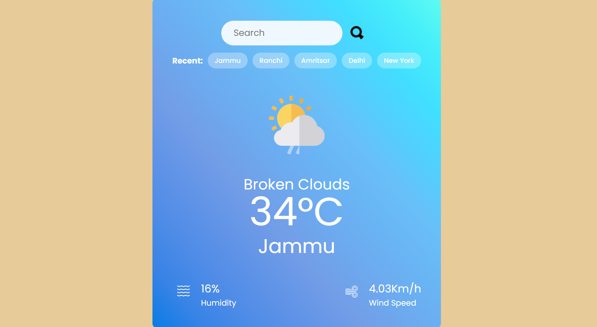
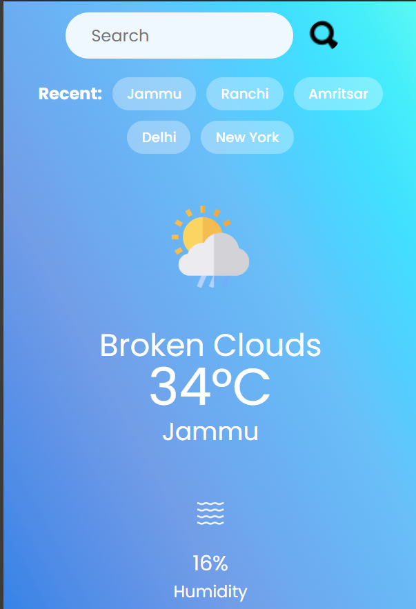

# 🌤️ Weather App

A sleek, responsive React-based weather application that fetches real-time weather data using the OpenWeatherMap API. Search for any city worldwide and get instant updates on temperature, humidity, wind speed, and weather conditions — all with a modern UI and persistent search history.

---

## 🚀 Live Demo

🔗 https://weather-app-j70r.onrender.com/ 

---

## 🛠 Features

- 🔍 Search any city worldwide
- 🌡️ View real-time temperature, humidity, wind speed, and weather condition icons
- 🔄 Retains the last 3 searched cities (stored in localStorage)
- ⚠️ Custom animated alerts for errors and notifications
- 🎨 Responsive & vibrant UI with dynamic weather icons
- 📱 Mobile-friendly design

---

## 📦 Tech Stack

- **React JS**
- **CSS** (Custom styling, responsive design)
- **OpenWeatherMap API**
- **LocalStorage** for recent searches

---

## 📸 Screenshots

| Desktop View | Mobile View |
|--------------|-------------|
 | 

---

## 🔧 Installation

1. **Clone the repo**

`bash
git clone https://github.com/nirmanraj0512/weather_app.git
cd weather_app

weather_app/
├── public/
├── src/
│   ├── assets/            # Weather icons
│   ├── Weather.jsx        # Main component
│   ├── Weather.css        # Stylesheet
│   └── main.jsx           # Entry point
├── .env
├── index.html
├── vite.config.js
├── package.json
└── README.md

🧠 Features Explained
Search Bar: Type any city and get the current weather.
Recent History: Stores the last 3 searched cities using localStorage.
Animated Alerts: Alerts for empty search, API errors, or network failures.
Dynamic Icons: Automatically switches weather icons based on real-time API data.
Responsive UI: Looks great on both mobile and desktop.

 Future Enhancements
 5-day weather forecast
 Dark mode toggle
 Geolocation-based weather data
 Voice-enabled search

 🙋‍♂️ Author
Nirman Raj
🔗 https://www.linkedin.com/in/nirmanraj0512/
🌐 https://nirman-stzk.onrender.com
